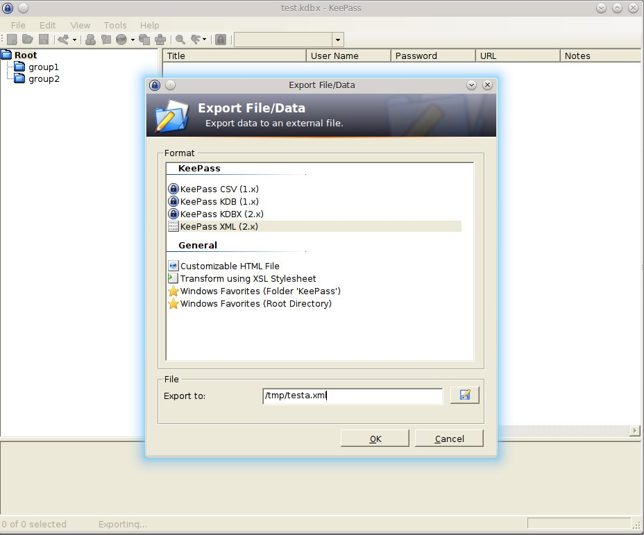

# compare-keepass2-xml

A Clojure script designed to compare exported keepass2 XML files.

Takes only *title*, *username*, *url*, *notes*, *password* into account. Prints
content to stdout! Review and modify the script to your needs.

## Requisites

* java 7
* [leiningen](https://github.com/technomancy/leiningen)

## Usage

### 1. Export the XMLs using keepass2



### 2. Compare the exported XMLs

```
$ lein run doc/testa.xml doc/testb.xml 
additional in doc/testa.xml 

{:title entry2, :notes , :url , :username user2, :pw secret2}

additional in doc/testb.xml 

{:title additional b, :notes , :url , :username user additional b, :pw pw additional b}
```

### 3. Fixit

* Then fix your keystores manually
* Delete or even shred the exported XMLs

## License

Copyright © 2016 Benjamin Peter

Distributed under the Eclipse Public License either version 1.0 or any later version.
